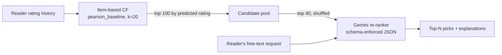

# 📖 Bookish — Two-Stage Book Recommender with LLM Re-Ranking

**[▶ Live demo](https://bookish-app.streamlit.app/)** · **[🎥 Video walkthrough](https://drive.google.com/file/d/1zCsk9pohiW-Qc2TAASAwLQIo4DtRB_b0/view?usp=sharing)** · Built by Sammi Bronow

Bookish recommends books in two stages. A tuned **item-based collaborative filtering** model generates personalized candidates from a reader's rating history. Then an **LLM re-ranker** reorders those candidates to match what the reader asks for in their own words ("a twisty mystery for a rainy Sunday") and explains each pick.

I then built an **offline evaluation harness** for the LLM layer. It uses LLM-as-judge scorers in Braintrust to compare prompt variants and pick the one to ship.

---

## Architecture



**Design choices**

- **The LLM can only re-rank the candidates.** It can't add books. A Pydantic response schema forces title, author and reason fields, and the system instruction limits picks to the candidate list.
- **Candidates are shuffled before the LLM sees them**, so it isn't biased toward items listed first (position bias).
- **The LLM runs only on explicit user input**, which keeps cost and latency off the default "For You" feed.
- **Item-based over user-based CF.** It scored better (below), and it supports "because you liked X" explanations, which readers understand more easily than "readers like you liked Y."

---

## Stage 1 — Collaborative filtering (candidate generation)

**Data:** about 10K books and 165K ratings from 1,192 Goodreads readers. Books with fewer than 10 ratings are excluded. 80/20 train/test split with a fixed seed.

**Evaluation:** ranking metrics (Precision@10, Recall@10) are the primary measure, with RMSE secondary. For a recommender, leaving a great book out of someone's top 10 costs more than being half a star off on a predicted rating.

**Search space:** similarity ∈ {Pearson, Pearson-baseline, Cosine} × k ∈ {10, 20, 30, 50}, user- and item-based.

| Model | Similarity | k | RMSE ↓ | Precision@10 ↑ | Recall@10 ↑ |
|---|---|---|---|---|---|
| Baseline | — | — | 0.8468 | 0.7195 | 0.5247 |
| UBCF (default) | Pearson | 20 | 1.0220 | 0.7264 | 0.5315 |
| IBCF (default) | Cosine | 20 | 0.8994 | 0.6378 | 0.4573 |
| UBCF (tuned) | Pearson-baseline | 50 | 0.9670 | 0.7393 | 0.5416 |
| **IBCF (tuned)** | **Pearson-baseline** | **20** | **0.8281** | **0.7423** | **0.5467** |

**What I took from it**

- Tuning mattered more than which algorithm I picked. Default IBCF was the *worst* model, and tuned IBCF was the best.
- Pearson-baseline similarity removes each user's and each book's rating bias before comparing items. That helps on sparse data.
- **The baseline is hard to beat.** Tuned IBCF improves on it by only about 2 points on Precision@10 and Recall@10. On a dataset dominated by popular titles, a simple baseline goes a long way. A production team should know that before investing in model complexity.

---

## Stage 2 — LLM re-ranking

The CF stage can't use what the reader wants *right now*. The LLM layer brings in mood, situation, content boundaries ("like Gone Girl but no blood"), and taste references.

The app has three modes. Each mode uses its own system instruction and temperature over the same candidate pool:

| Mode | Temp | Behavior |
|---|---|---|
| ✓ Match Me | 0.2 | The closest fit to the request, with neutral explanations |
| 🔥 Roast Me | 0.9 | Same caliber of picks, delivered with a comedic voice (designed to get shared) |
| 🎲 Surprise Me | 1.4 | Deliberately skips the obvious picks, but still connects to the request |

**Finding:** changing the system instruction changed the *voice* far more than the *picks*. Match Me and Roast Me usually agree on the top pick. Surprise Me brings up different titles.

---

## Offline evaluation of the re-ranker

**Eval set:** 10 readers (≥20 ratings each) × 2 contrasting requests ("dark and scary," "fast-paced with a shocking ending") = 20 cases. For each reader, the top 10 CF candidates are fixed, so differences come from the prompt alone.

**Scorers (LLM-as-judge, GPT-4o-mini):**
- **Ranking judge:** do the top 3 picks fit the request, and are they in the right order? Penalizes any pick not in the candidate list.
- **Explanation judge:** is each explanation specific and grounded in the book, and tied to the request?
- The judge comes from a **different model family** than the generator (Gemini), to limit self-preference bias.

**Results (Gemini 2.5 Flash, temperature 0):**

| Prompt | Ranking fit | Explanation quality | Total tokens |
|---|---|---|---|
| A — baseline | 52.5% | 92.5% | 43.8K |
| **B — designed (winner - would ship this one)** | **70.0%** | **100%** | 76.2K |
| B v2 (temp 0.3) | 60.0% | 100% | 76.9K |
| B v3 (non-fiction constraint) | 65.0% | 100% | 75.7K |

**What made Prompt B better:** it says the candidates came from a CF model, tells the model to put thematic fit ahead of average rating, applies criteria in a fixed order (fit → quality → specificity), and requires explanations grounded in each book's content.

**Ship decision:** Prompt B, despite using about 74% more tokens. A weak match costs user trust, and that's worth more than the extra tokens. Two follow-up variants didn't improve ranking fit. My read is that the 70% ceiling comes from the candidate pool, not the prompt: when no candidate matches the request well, the prompt can't fix that.

**Limitations:** n=20. The judges aren't calibrated against human labels. Only two kinds of requests were tested. Judge position and length bias weren't measured. Full results and judge prompts: [evaluation_results.pdf](docs/evaluation_results.pdf).

## What I'd do next

1. **Evaluate the LLM layer against what readers actually liked.** Measure NDCG@K on held-out ratings after re-ranking, not only judge scores.
2. **Calibrate the judges.** Hand-label a small golden set, then measure how often the judges agree with it.
3. **Cold start.** Add a "pick 3 books you love" flow for new readers, using item–item similarity directly, with the popularity baseline as fallback.
4. **Widen retrieval** (larger k, embedding-based candidates) to get past the ranking-fit ceiling.
5. **Online test.** A/B the re-ranker against CF-only order on add-to-shelf rate per session.


## What's in this repo

| File | What it is |
|---|---|
| `app.py` | The Streamlit app (CF candidates + Gemini reranking) |
| `notebooks/01_cf_model_tuning.ipynb` | EDA, model comparison and hyperparameter tuning for the CF stage |
| `notebooks/02_eval_dataset.ipynb` | Builds the evaluation set used to score the reranker |
| `docs/bookish_slides.pdf` | Project overview slides |
| `docs/evaluation_results.pdf` | Evaluation design, judge setup and prompt comparison results |
| `Books.csv`, `Ratings.csv` | Goodreads sample used to train the model |

---

## Run it locally

```bash
pip install -r requirements.txt
# add GEMINI_API_KEY to .streamlit/secrets.toml
streamlit run app.py
```

**Stack:** Python · pandas · scikit-surprise · Gemini (google-genai) · Pydantic · Streamlit · Braintrust · GPT-4o-mini (judges)
